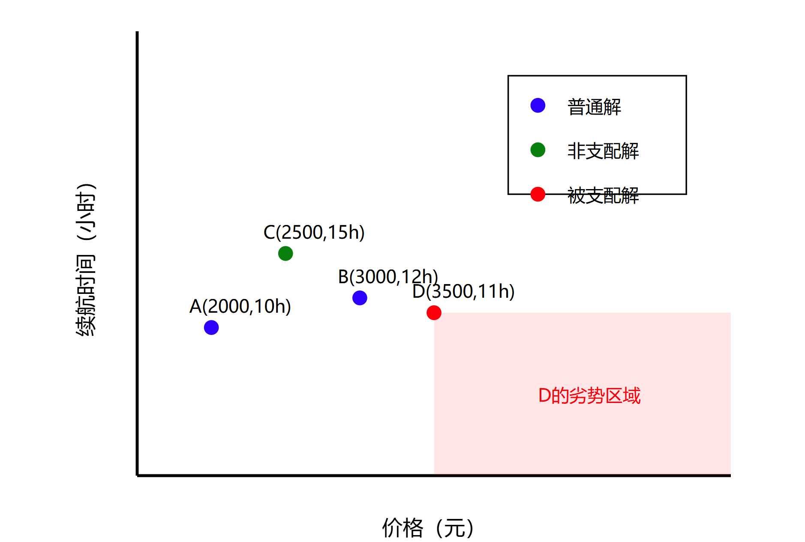
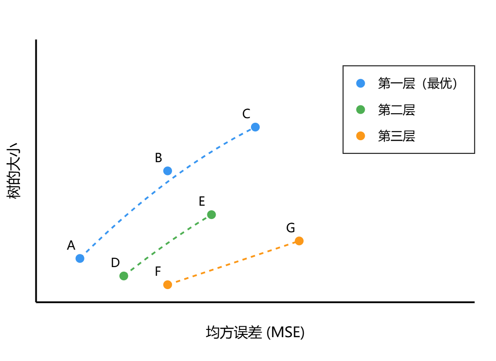

# NSGA-II多目标优化算法学习笔记

## 一、基本概念

### 1.1 多目标优化问题
在实际工程中，我们经常需要同时优化多个目标。这些目标可能是相互冲突的，比如在我们的遗传编程问题中：
- 最小化均方误差(MSE)：使表达式更准确
- 最小化树的大小：使表达式更简洁

这就像在生活中选择商品时，我们既想要高品质，又想要低价格。

### 1.2 支配关系
支配是多目标优化中的核心概念。假设有两个解A和B，如果：
- A在所有目标上都不比B差
- 且至少在一个目标上比B好

那么我们说"A支配B"。这就像手机的例子：
- 手机A：2000元，续航10小时
- 手机B：3000元，续航12小时
- 手机C：2500元，续航15小时
- 手机D：3500元，续航11小时

手机C是一个非支配解，因为没有其他手机能在价格和续航两个方面都比它更好。

## 二、NSGA-II算法工作原理

### 2.1 非支配排序
算法首先对所有解进行分层：
1. 找出所有不被任何解支配的解，形成第一层
2. 暂时移除这一层，在剩余解中重复步骤1，形成第二层
3. 依此类推，直到所有解都被分层

### 2.2 拥挤度计算
在同一层内，算法通过计算解的"拥挤度"来保持多样性：
- 拥挤度表示解在目标空间中的独特程度
- 周围解越少，拥挤度越大
- 优先保留拥挤度大的解，以确保解集的广泛分布

### 2.3 选择机制
当需要从种群中选择个体时：
1. 优先选择层级数小的解（第一层优先于第二层）
2. 在同一层内，优先选择拥挤度大的解
3. 这确保了：
   - 解的质量（通过层级）
   - 解的多样性（通过拥挤度）

## 三、在遗传编程中的应用

在我们的符号回归问题中，NSGA-II帮助我们：
1. 找到多个具有不同特点的优秀解：
   - x * x （最简单的精确解）
   - (x * x) + 0.001 （稍复杂但误差很小）
   - x * (x + 0) （中等复杂度）

2. 在精确度和复杂度之间取得平衡：
   - 不会盲目追求精确度而导致表达式过于复杂
   - 也不会过分追求简单而牺牲太多精确度

## 四、总结

NSGA-II算法的优势：
1. 能同时处理多个优化目标
2. 保持解的多样性
3. 提供一系列权衡解供决策参考
4. 计算效率高
5. 适用于各种多目标优化问题

在实际应用中，NSGA-II帮助我们在多个相互冲突的目标之间找到最佳平衡点，就像在购物时在预算和性能之间做出明智的选择一样。