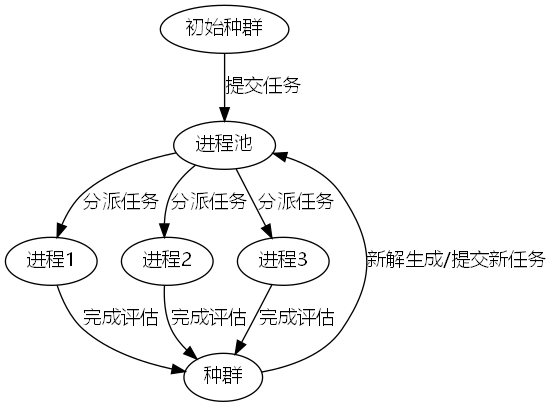

### 动机
遗传编程在并行评估的过程中，存在一个瓶颈即快的个体需要等待慢的个体评估完成才能进入下一代，导致整体CPU利用率不高。

实际上，在演化计算中，评估是可以异步执行的。

遗传编程通常使用的编程范式是Generation-based，即每一代的个体需要等待所有个体评估完成才能进入下一代。

**但是，我们也可以使用Steady-state-based的编程范式，即每一个个体都是异步评估的，从而提高CPU利用率。**

详细解释一下遗传编程中异步评估的原理。

在传统的遗传编程中，我们使用世代(Generation-based)的方式进行进化。这意味着在每一代中，所有个体都需要按顺序完成评估，然后才能进入下一代。这就像是在跑接力赛，每个选手都要等待前一个选手完成才能开始跑。这种方式存在一个明显的问题：如果某些个体的评估特别耗时，其他已经完成评估的个体就需要等待，造成计算资源的浪费。

而异步评估采用了完全不同的方式，更像是一个繁忙的餐厅的运作方式：

1. 任务分配机制：
   - 系统创建一个进程池（ProcessPoolExecutor），就像餐厅有多个厨师一样
   - 每个待评估的个体都被视为一个独立的任务，通过executor.submit()提交给进程池
   - 进程池会自动将这些任务分配给空闲的进程，就像主厨将订单分配给空闲的厨师

2. 并行执行过程：
   - 多个个体可以同时被评估，每个进程独立工作
   - 使用futures字典跟踪所有正在进行的评估任务
   - 通过concurrent.futures.wait()方法等待任意一个评估完成
   - 完成评估的个体立即被处理，不需要等待其他个体

3. 动态种群更新：
   - 只要有个体完成评估，就立即将其加入种群
   - 如果新个体的适应度更好，可以立即替换掉种群中较差的个体
   - 当累积了足够的已评估个体（代码中的all_done列表），就可以开始生成下一批新个体

用一个例子来说明：
```python
# 假设我们有4个处理器核心，提交了6个待评估的个体
executor = concurrent.futures.ProcessPoolExecutor(max_workers=4)
# 个体1-4立即开始评估
# 个体5-6等待空闲处理器

# 假设个体2先完成评估
# 1. 处理个体2的结果
# 2. 将个体5分配给空闲的处理器
# 3. 不需要等待个体1,3,4完成

# 这个过程持续进行，保持处理器始终处于工作状态
```

这种方式的优势在于：
1. 提高CPU利用率：处理器几乎不会处于空闲状态
2. 减少等待时间：评估快的个体不需要等待慢的个体
3. 更灵活的进化过程：可以即时利用好的解决方案
4. 自动负载均衡：进程池会自动调度任务到空闲处理器

现在，通过一个简单的[例子](./multiprocess_speedup.py)，来展示出一下如何使用基于Python实现遗传编程的并行评估。


```python
import concurrent.futures
import random
import time

import numpy
import numpy as np
from deap import base, creator, gp
from deap import tools
from deap.algorithms import varAnd, eaSimple
from deap.tools import selBest

# 使用numpy创建一个数据集
x = np.linspace(-10, 10, 1000000)


# 符号回归
def evalSymbReg(ind):
    func = toolbox.compile(ind)
    # 评估生成的函数并计算MSE
    mse = np.mean((func(x) - (x + 1) ** 2) ** 2)
    return (mse,)


# 创建个体和适应度函数
creator.create("FitnessMin", base.Fitness, weights=(-1.0,))
creator.create("Individual", gp.PrimitiveTree, fitness=creator.FitnessMin)

# 定义函数和终端变量
pset = gp.PrimitiveSet("MAIN", arity=1)
pset.addPrimitive(np.add, 2)
pset.addPrimitive(np.subtract, 2)
pset.addPrimitive(np.multiply, 2)
pset.addPrimitive(np.negative, 1)


def random_int():
    return random.randint(-1, 1)


pset.addEphemeralConstant("rand101", random_int)
pset.renameArguments(ARG0="x")

# 定义遗传编程操作
toolbox = base.Toolbox()
toolbox.register("expr", gp.genHalfAndHalf, pset=pset, min_=2, max_=6)
toolbox.register("individual", tools.initIterate, creator.Individual, toolbox.expr)
toolbox.register("population", tools.initRepeat, list, toolbox.individual)
toolbox.register("compile", gp.compile, pset=pset)
toolbox.register("evaluate", evalSymbReg)
toolbox.register("select", tools.selTournament, tournsize=3)
toolbox.register("mate", gp.cxOnePoint)
toolbox.register("mutate", gp.mutUniform, expr=toolbox.expr, pset=pset)

# 定义统计指标
stats_fit = tools.Statistics(lambda ind: ind.fitness.values)
stats_size = tools.Statistics(len)
mstats = tools.MultiStatistics(fitness=stats_fit, size=stats_size)
mstats.register("avg", numpy.mean)
mstats.register("std", numpy.std)
mstats.register("min", numpy.min)
mstats.register("max", numpy.max)
```

### 异步并行
在本教程中，异步并行处理是通过ProcessPoolExecutor实现的。
简单来说，原理是创建一个进程池，然后将评估任务提交给进程池，进程池会自动分配任务给空闲的进程，如下图所示。



当任何一个进程完成评估任务时，我们可以获取其结果。如果新个体的适应度好于种群中的最差个体，我们可以将其加入种群，替换掉最差个体。
当至少两个任务完成时，我们可以开始下一代的演化。实际上，开始下一代演化的条件是一个可以调节的参数，这里设置的越小，CPU利用率越高。

```python
def steady_state_gp(
    population,
    toolbox,
    cxpb,
    mutpb,
    max_evaluations,
    stats=None,
    halloffame=None,
    verbose=__debug__,
):
    logbook = tools.Logbook()
    logbook.header = ["evals", "nevals"] + (stats.fields if stats else [])

    executor = concurrent.futures.ProcessPoolExecutor(max_workers=4)
    futures = {}
    evaluations =0

    # 评估初始种群
    for i, ind in enumerate(population):
        if not ind.fitness.valid:
            future = executor.submit(toolbox.evaluate, ind)
            futures[future] = ind

    all_done = population

    while evaluations < max_evaluations:
        # 生成新个体
        if evaluations + len(futures) <= max_evaluations and len(all_done) >= 2:
            selected = toolbox.select(population, len(all_done))
            offspring = varAnd(selected, toolbox, cxpb, mutpb)
            all_done = []

            # 提交评估任务
            for child in offspring:
                if evaluations + len(futures) <= max_evaluations:
                    future = executor.submit(toolbox.evaluate, child)
                    futures[future] = child
                else:
                    break

        # 等待至少一个个体完成评估
        current_done, _ = concurrent.futures.wait(
            list(futures.keys()),
            return_when=concurrent.futures.FIRST_COMPLETED,
        )

        # 处理评估完成的个体
        done_inds = []
        for future in current_done:
            ind = futures.pop(future)
            ind.fitness.values = future.result()
            done_inds.append(ind)
            all_done.append(ind)
            evaluations += 1

        if halloffame is not None:
            halloffame.update(done_inds)

        # 用高适应度个体替换低适应度个体
        population = selBest(population + done_inds, len(population))

        if verbose and evaluations % 100 == 0:
            record = stats.compile(population) if stats else {}
            logbook.record(evals=evaluations, **record)
            print(logbook.stream)

    executor.shutdown()
    return population, logbook
```

### 结果测试
最后，我们可以测试一下异步并行和传统的串行遗传编程算法的区别。
从下面的测试结果可以看出，异步并行的遗传编程算法的速度要快于传统的串行遗传编程算法。
异步并行的遗传编程算法只消耗了10秒，而传统的串行遗传编程算法消耗了16秒。

```python
start = time.time()
population = toolbox.population(n=100)
hof = tools.HallOfFame(1)
pop, log = steady_state_gp(
    population=population,
    toolbox=toolbox,
    cxpb=0.9,
    mutpb=0.1,
    max_evaluations=(5+1) * 100,
    stats=mstats,
    halloffame=hof,
    verbose=True,
)
end = time.time()
print("time:", end - start)

start = time.time()
population = toolbox.population(n=100)
hof = tools.HallOfFame(1)
pop, log = eaSimple(
    population=population,
    toolbox=toolbox,
    cxpb=0.9,
    mutpb=0.1,
    ngen=5,
    stats=mstats,
    halloffame=hof,
    verbose=True,
)
end = time.time()
print("time:", end - start)
```

运行结果：

```bash
(base) glk@ggg:~/project/DEAP-GP-Tutorial/tricks$ python multiprocess_speedup.py
                                fitness                                   size                 
                --------------------------------------- ---------------------------------------
evals   nevals  avg     evals   max     min     std     avg     evals   max     min     std    
100             2133.45 100     8267.7  34.3334 1140.91 15.59   100     87      3       13.3065
200             1791.05 200     2270.68 33.3334 767.596 16.44   200     93      3       14.8211
300             1433.15 300     2133.34 33.3334 885.326 17.79   300     77      2       12.8828
400             886.52  400     2033.34 9       893.125 22.95   400     114     5       16.1353
500             171.297 500     1204    0       222.676 22.67   500     114     6       15.602 
600             73.4168 600     134.334 0       51.5433 21.46   600     114     6       13.0732
time: 7.839663743972778
                                          fitness                                                     size                     
                -----------------------------------------------------------     -----------------------------------------------
gen     nevals  avg     gen     max             min     nevals  std             avg     gen     max     min     nevals  std    
0       100     155390  0       1.06949e+07     1       100     1.06709e+06     20.22   0       81      3       100     16.3863
1       92      574255  1       4.50408e+07     1       92      4.60397e+06     18.1    1       66      2       92      14.9482
2       98      907309  2       4.55638e+07     1.32025e-29     98      6.25981e+06     19.1    2       89      3       98      15.6272
3       93      9.40502e+10     3       9.39077e+12     1.32025e-29     93      9.34357e+11     22.67   3       104     4       93      20.1137
4       91      22829.1         4       1.26186e+06     1.32025e-29     91      129481          27.63   4       102     4       91      23.2214
5       93      1.53649e+08     5       1.53627e+10     1.32025e-29     93      1.52856e+09     35.2    5       108     6       93      26.4798
time: 9.215850591659546
```